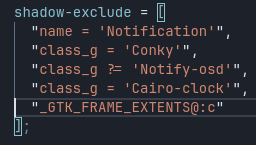
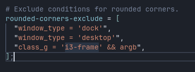
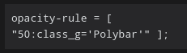

use
xprop to find the class of whatever you want to exclude
And now you can use it in any way you want

### Add a rule using that class:

### Or add it to a list of exclusions:

### Or apply a specific rule:

